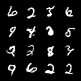
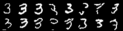
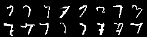

# PixelCNN

A simple implementation of PixelCNN.
It supports A/B style PixelCNN masking. There are no residual or gated blocks.
Image can be conditioned on a vector (eg class one hot vector).

Model in MNIST.ipynb achieved validation log likelihood 61.56 (nats)

Model in MNIST_ConditionedOnLabel.ipynb achieved valiation log likelihood 57.99 (nats)

References:

https://arxiv.org/abs/1601.06759

    misc{oord2016pixel,
    title={Pixel Recurrent Neural Networks}, 
    author={Aaron van den Oord and Nal Kalchbrenner and Koray Kavukcuoglu},
    year={2016},
    eprint={1601.06759},
    archivePrefix={arXiv},
    primaryClass={cs.CV}
    }

https://arxiv.org/abs/1606.05328

    misc{oord2016conditional,
    title={Conditional Image Generation with PixelCNN Decoders}, 
    author={Aaron van den Oord and Nal Kalchbrenner and Oriol Vinyals and Lasse Espeholt and Alex Graves and Koray Kavukcuoglu},
    year={2016},
    eprint={1606.05328},
    archivePrefix={arXiv},
    primaryClass={cs.CV}
    }
