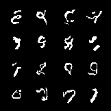
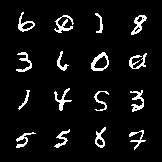

# PixelCNN

A simplified implementation of the ideas from the paper:

https://arxiv.org/abs/1601.06759

    misc{oord2016pixel,
    title={Pixel Recurrent Neural Networks}, 
    author={Aaron van den Oord and Nal Kalchbrenner and Koray Kavukcuoglu},
    year={2016},
    eprint={1601.06759},
    archivePrefix={arXiv},
    primaryClass={cs.CV}
    }

This is a very basic implementation without residual blocks.

#MNIST

Model in MNIST.ipynb achieved validation log likelihood 67.9 (nats)

Model in deep_MNIST.ipynb achieved valiation log likelihood 60.2 (nats)

